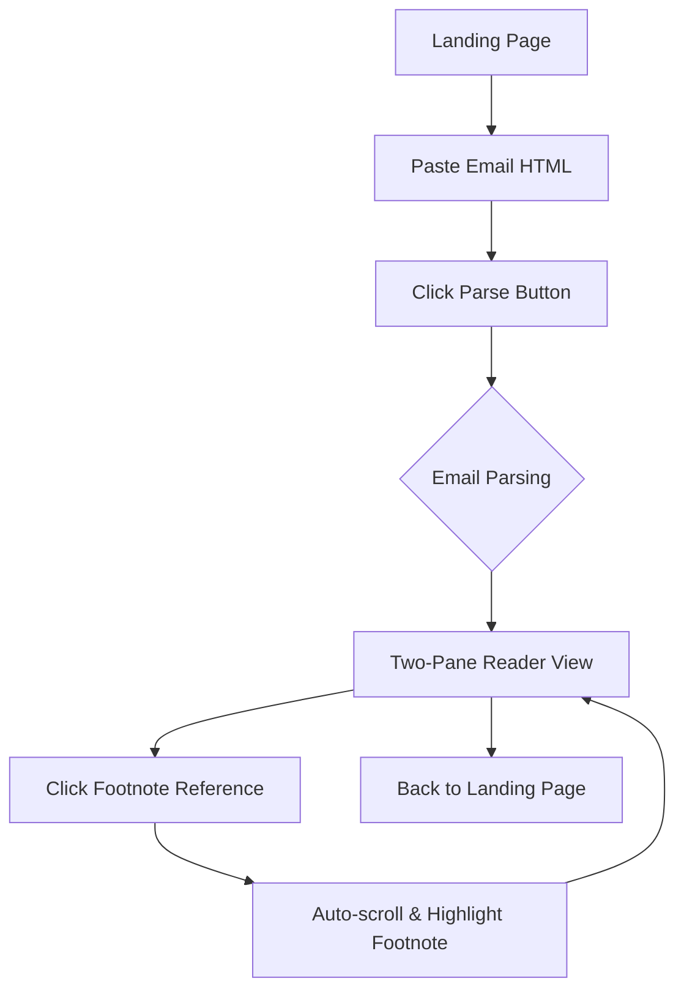
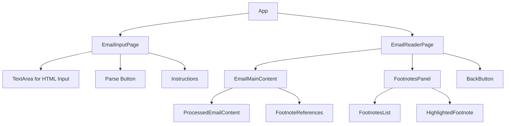

# Matt Levine Email Reader - Architecture Plan

## Overview
A React application that helps users read Matt Levine's "Money Stuff" emails by providing a two-pane layout with main content on top and footnotes on the bottom, both scrollable independently.

## Technology Stack
- **Frontend**: Vite + React 18 + TypeScript
- **UI Library**: Material-UI (MUI) v5
- **Build Tool**: Vite for fast development and optimized builds
- **Package Manager**: npm (standard with Vite)

## Application Flow


## Component Architecture


## Key Features & Implementation Details

### 1. Email Parsing Logic
- **Input**: Raw HTML email content pasted by user
- **Processing**: 
  - Look for the specific delimiter: "If you'd like to get Money Stuff..." paragraph
  - Split content at this delimiter
  - Main content = everything before the delimiter
  - Footnotes section = everything after the delimiter
  - Identify footnote references `[1]`, `[2]`, etc. in main text
  - Parse individual footnotes with their numbers from the footnotes section
- **Output**: Structured data with main content and footnotes array

### 2. Two-Pane Layout
- **Top Pane (60% height)**: Main email content with clickable footnote references
- **Bottom Pane (40% height)**: Footnotes list with independent scrolling
- **Responsive**: Stack vertically on mobile devices
- **Divider**: Visual separation between panes

### 3. Interactive Footnote System
- **Clickable References**: `[1]`, `[2]` etc. become clickable buttons in main content
- **Auto-scroll**: Clicking reference scrolls corresponding footnote into view in bottom pane
- **Highlighting**: Active footnote gets highlighted background
- **Smooth Animations**: CSS transitions for scroll and highlight effects

### 4. UI/UX Components
- **Landing Page**: Clean input form with instructions
- **Reader Page**: Two-pane layout with navigation controls
- **Loading States**: Progress indicators during parsing
- **Error Handling**: User-friendly messages for parsing failures

## Project Structure
```
mattreader/
├── src/
│   ├── components/
│   │   ├── EmailInputPage.tsx
│   │   ├── EmailReaderPage.tsx
│   │   ├── EmailMainContent.tsx
│   │   ├── FootnotesPanel.tsx
│   │   └── index.ts
│   ├── utils/
│   │   ├── emailParser.ts
│   │   └── types.ts
│   ├── hooks/
│   │   └── useEmailData.ts
│   ├── App.tsx
│   ├── main.tsx
│   └── index.css
├── package.json
├── tsconfig.json
├── vite.config.ts
└── index.html
```

## Data Types
```typescript
interface ParsedEmail {
  mainContent: string;
  footnotes: Footnote[];
}

interface Footnote {
  id: number;
  content: string;
  originalHtml?: string;
}

interface EmailParserState {
  rawHtml: string;
  parsedEmail: ParsedEmail | null;
  isLoading: boolean;
  error: string | null;
}
```

## Parser Implementation Details
The email parser will use the following strategy:

1. **Find Delimiter**: Look for paragraph containing "If you'd like to get Money Stuff"
2. **Split Content**: 
   - Main content = everything before delimiter
   - Footnotes section = everything after delimiter
3. **Extract Footnote References**: Use regex to find `[1]`, `[2]`, etc. in main content
4. **Parse Footnotes**: Extract individual footnotes from the footnotes section
5. **Create Mapping**: Map footnote references to their content

### Example Structure:
```
Main email content with footnote references [1], [2]...

If you'd like to get Money Stuff in handy email form, right in your inbox, please subscribe at this link. Or you can subscribe to Money Stuff and other great Bloomberg newsletters here. Thanks!

[1] First footnote content...
[2] Second footnote content...
```

## Implementation Phases

### Phase 1: Project Setup
1. Initialize Vite + React + TypeScript project
2. Install and configure Material-UI
3. Set up basic routing (landing page ↔ reader page)
4. Create basic component structure

### Phase 2: Email Parser
1. Implement HTML parsing utilities with specific delimiter logic
2. Create footnote detection regex patterns
3. Build main content and footnotes extraction logic
4. Add error handling for malformed emails

### Phase 3: UI Components
1. Build email input page with MUI components
2. Create two-pane reader layout
3. Implement footnote reference click handlers
4. Add smooth scrolling and highlighting

### Phase 4: Polish & Testing
1. Add loading states and error boundaries
2. Implement responsive design
3. Test with actual Matt Levine email samples
4. Add accessibility features (ARIA labels, keyboard navigation)

## Material-UI Components to Use
- `Container`, `Box`, `Paper` for layout
- `TextField` (multiline) for email input
- `Button`, `IconButton` for actions
- `Typography` for text styling
- `Divider` for section separation
- `List`, `ListItem` for footnotes
- `Chip` or `Badge` for footnote numbers
- `LinearProgress` for loading states

## User Experience Flow
1. **Landing Page**: User sees instructions and large text area for pasting email
2. **Paste Email**: User pastes HTML email content from their email client
3. **Parse**: User clicks "Parse Email" button
4. **Reader View**: Two-pane layout appears with:
   - Top: Main email content with clickable footnote references
   - Bottom: Footnotes list, initially scrolled to top
5. **Interaction**: User clicks footnote reference `[1]` in main content
6. **Auto-scroll**: Bottom pane automatically scrolls to footnote [1] and highlights it
7. **Continue Reading**: User can continue reading and clicking other footnote references
8. **Return**: User can go back to landing page to parse another email

## Technical Considerations
- **Performance**: Use React.memo and useMemo for large email content
- **Accessibility**: Proper ARIA labels and keyboard navigation
- **Mobile**: Responsive design that stacks panes vertically on small screens
- **Error Handling**: Graceful degradation if parsing fails
- **TypeScript**: Strong typing throughout for better developer experience

This architecture provides a clean, maintainable solution that solves the core problem of easily accessing footnotes while reading Matt Levine's emails.